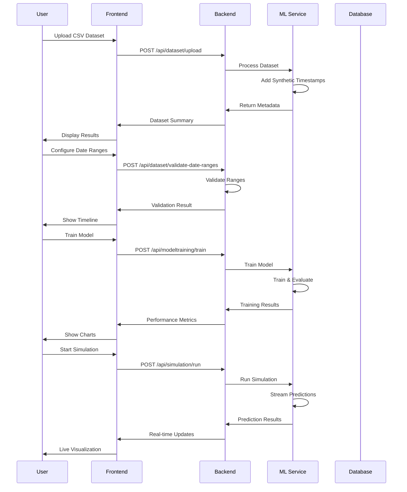

# IntelliInspect - System Design Document

## 1. System Overview

IntelliInspect is a full-stack AI-powered quality control prediction system designed to process Kaggle Bosch Production Line Performance data and provide real-time quality predictions through a web-based interface.

### 1.1 Objectives
- Enable real-time quality control prediction using machine learning
- Provide an intuitive 4-step wizard interface for dataset processing
- Support multiple ML algorithms (XGBoost, LightGBM, Random Forest)
- Implement time-based data segmentation for training, testing, and simulation
- Deliver real-time streaming predictions with visual feedback

### 1.2 Key Features
- CSV dataset upload with drag-and-drop interface
- Synthetic timestamp generation for time-series analysis
- Interactive date range configuration with validation
- Multi-algorithm model training with performance metrics
- Real-time prediction simulation with live charts and statistics

## 2. System Architecture

### 2.1 High-Level Architecture

```
┌─────────────────────────────────────────────────────────────────┐
│                        User Interface Layer                     │
├─────────────────────────────────────────────────────────────────┤
│  Angular Frontend (Port 4200)                                  │
│  - 4-Step Wizard Interface                                     │
│  - Real-time Charts & Visualizations                          │
│  - Drag-and-Drop File Upload                                   │
└─────────────────────────────────────────────────────────────────┘
                                │
                                ▼
┌─────────────────────────────────────────────────────────────────┐
│                        API Gateway Layer                        │
├─────────────────────────────────────────────────────────────────┤
│  .NET Core Backend (Port 5000)                                 │
│  - RESTful API Endpoints                                       │
│  - Request/Response Validation                                 │
│  - Service Orchestration                                       │
└─────────────────────────────────────────────────────────────────┘
                                │
                    ┌───────────┴───────────┐
                    ▼                       ▼
┌─────────────────────────┐    ┌─────────────────────────┐
│    Data Layer           │    │    ML Processing Layer  │
├─────────────────────────┤    ├─────────────────────────┤
│  SQL Server (Port 1433) │    │  Python ML Service      │
│  - Dataset Storage      │    │  (Port 8000)            │
│  - Metadata Management  │    │  - FastAPI Framework    │
│  - Configuration Data   │    │  - XGBoost/LightGBM     │
└─────────────────────────┘    │  - Real-time Inference  │
                               └─────────────────────────┘
```

### 2.2 Component Interaction Flow



## 3. Data Flow Architecture

### 3.1 Dataset Processing Pipeline

```
CSV Upload → Validation → Timestamp Augmentation → Metadata Extraction → Storage
     │              │              │                    │              │
     ▼              ▼              ▼                    ▼              ▼
File Check → Schema Check → Time Series → Statistics → Database
```

### 3.2 Model Training Pipeline

```
Data Split → Feature Engineering → Model Training → Evaluation → Storage
     │              │                    │              │          │
     ▼              ▼                    ▼              ▼          ▼
Train/Test → Preprocessing → Algorithm → Metrics → Model Artifacts
```

### 3.3 Real-Time Simulation Pipeline

```
Historical Data → Feature Extraction → Model Inference → Result Streaming
       │                  │                    │              │
       ▼                  ▼                    ▼              ▼
Simulation Period → Preprocessing → Prediction → Live Updates
```

## 4. API Contract Design

### 4.1 Dataset Upload API

**Endpoint**: `POST /api/dataset/upload`

**Request**:
```http
Content-Type: multipart/form-data
Body: CSV file
```

**Response**:
```json
{
  "totalRecords": 14704,
  "totalColumns": 5,
  "passRate": 70.5,
  "earliestTimestamp": "2021-01-01T00:00:00Z",
  "latestTimestamp": "2021-12-31T23:59:59Z",
  "syntheticTimestampAdded": true,
  "fileName": "production_data.csv"
}
```

### 4.2 Date Range Validation API

**Endpoint**: `POST /api/dataset/validate-date-ranges`

**Request**:
```json
{
  "trainingStart": "2021-01-01T00:00:00Z",
  "trainingEnd": "2021-03-31T23:59:59Z",
  "testingStart": "2021-04-01T00:00:00Z",
  "testingEnd": "2021-06-30T23:59:59Z",
  "simulationStart": "2021-07-01T00:00:00Z",
  "simulationEnd": "2021-09-30T23:59:59Z"
}
```

**Response**:
```json
{
  "isValid": true,
  "message": "Date ranges validated successfully!",
  "trainingRecordCount": 3000,
  "testingRecordCount": 3000,
  "simulationRecordCount": 3000,
  "trainingDays": 90,
  "testingDays": 90,
  "simulationDays": 90
}
```

### 4.3 Model Training API

**Endpoint**: `POST /api/modeltraining/train`

**Request**:
```json
{
  "trainStart": "2021-01-01T00:00:00Z",
  "trainEnd": "2021-03-31T23:59:59Z",
  "testStart": "2021-04-01T00:00:00Z",
  "testEnd": "2021-06-30T23:59:59Z",
  "modelType": "xgboost"
}
```

**Response**:
```json
{
  "accuracy": 92.5,
  "precision": 89.3,
  "recall": 91.7,
  "f1Score": 90.5,
  "confusionMatrix": {
    "truePositive": 850,
    "trueNegative": 920,
    "falsePositive": 80,
    "falseNegative": 70
  },
  "trainingLoss": [0.5, 0.4, 0.3, 0.25, 0.2],
  "trainingAccuracy": [0.6, 0.7, 0.75, 0.8, 0.82],
  "featureImportance": {
    "feature_1": 0.15,
    "feature_2": 0.12,
    "feature_3": 0.10
  }
}
```

### 4.4 Simulation API

**Endpoint**: `POST /api/simulation/run`

**Request**:
```json
{
  "simulationStart": "2021-07-01T00:00:00Z",
  "simulationEnd": "2021-09-30T23:59:59Z",
  "modelType": "xgboost"
}
```

**Response**:
```json
{
  "totalPredictions": 3000,
  "passCount": 2100,
  "failCount": 900,
  "averageConfidence": 87.3,
  "predictions": [
    {
      "sampleId": "12345",
      "timestamp": "2021-07-01T00:00:00Z",
      "prediction": 1,
      "confidence": 89.5,
      "features": {
        "temperature": 25.3,
        "pressure": 1013.2,
        "humidity": 65.1
      }
    }
  ]
}
```

## 5. Database Schema Design

### 5.1 Core Tables

```sql
-- Production Records
CREATE TABLE ProductionRecords (
    Id INT PRIMARY KEY IDENTITY(1,1),
    OriginalId INT NOT NULL,
    Response INT NULL,
    SyntheticTimestamp DATETIME2 NOT NULL,
    CreatedAt DATETIME2 DEFAULT GETUTCDATE(),
    UpdatedAt DATETIME2 DEFAULT GETUTCDATE()
);

-- Numeric Features
CREATE TABLE NumericFeatures (
    Id INT PRIMARY KEY IDENTITY(1,1),
    ProductionRecordId INT NOT NULL,
    FeatureName NVARCHAR(100) NOT NULL,
    FeatureValue FLOAT NOT NULL,
    FOREIGN KEY (ProductionRecordId) REFERENCES ProductionRecords(Id)
);

-- Categorical Features
CREATE TABLE CategoricalFeatures (
    Id INT PRIMARY KEY IDENTITY(1,1),
    ProductionRecordId INT NOT NULL,
    FeatureName NVARCHAR(100) NOT NULL,
    FeatureValue NVARCHAR(500) NOT NULL,
    FOREIGN KEY (ProductionRecordId) REFERENCES ProductionRecords(Id)
);

-- Prediction Results
CREATE TABLE PredictionResults (
    Id INT PRIMARY KEY IDENTITY(1,1),
    ProductionRecordId INT NOT NULL,
    Prediction INT NOT NULL,
    Confidence FLOAT NOT NULL,
    ModelType NVARCHAR(50) NOT NULL,
    CreatedAt DATETIME2 DEFAULT GETUTCDATE(),
    FOREIGN KEY (ProductionRecordId) REFERENCES ProductionRecords(Id)
);
```

## 6. Security Design

### 6.1 Security Layers

1. **Input Validation**
   - File type validation (CSV only)
   - File size limits
   - SQL injection prevention
   - XSS protection

2. **Authentication & Authorization**
   - CORS configuration
   - API rate limiting
   - Request validation

3. **Data Protection**
   - Encrypted database connections
   - Secure file upload handling
   - Input sanitization

### 6.2 Container Security

- Non-root user execution
- Minimal base images
- Regular security updates
- Network isolation

## 7. Performance Design

### 7.1 Scalability Considerations

- **Horizontal Scaling**: Stateless services enable easy scaling
- **Caching**: In-memory caching for frequently accessed data
- **Database Optimization**: Indexed queries and connection pooling
- **Async Processing**: Non-blocking I/O operations

### 7.2 Performance Metrics

- **Response Time**: < 2 seconds for API calls
- **Throughput**: 100+ concurrent users
- **Memory Usage**: < 2GB per service
- **Training Time**: 2-5 minutes for typical datasets

## 8. Monitoring & Logging

### 8.1 Application Monitoring

- Health check endpoints
- Performance metrics collection
- Error tracking and alerting
- Resource utilization monitoring

### 8.2 Logging Strategy

- Structured logging (JSON format)
- Log levels (DEBUG, INFO, WARN, ERROR)
- Centralized log aggregation
- Request/response logging

## 9. Deployment Architecture

### 9.1 Container Orchestration

```yaml
services:
  frontend:
    image: intelliinspect-frontend
    ports: ["4200:80"]
    depends_on: [backend]
  
  backend:
    image: intelliinspect-backend
    ports: ["5000:80"]
    depends_on: [ml-service, database]
  
  ml-service:
    image: intelliinspect-ml
    ports: ["8000:8000"]
    volumes: [ml-models:/app/models]
  
  database:
    image: mssql/server:2022-latest
    ports: ["1433:1433"]
    volumes: [database-data:/var/opt/mssql]
```

### 9.2 Environment Configuration

- **Development**: Local Docker containers
- **Staging**: Cloud-based deployment
- **Production**: Kubernetes orchestration

## 10. Future Enhancements

### 10.1 Planned Features

- **Model Versioning**: Track and manage model versions
- **A/B Testing**: Compare different model performances
- **Real-time Alerts**: Notification system for quality issues
- **Advanced Analytics**: Detailed performance dashboards

### 10.2 Scalability Improvements

- **Microservices**: Further service decomposition
- **Message Queues**: Asynchronous processing
- **Load Balancing**: Traffic distribution
- **Auto-scaling**: Dynamic resource allocation

---

This design document provides a comprehensive overview of the IntelliInspect system architecture, ensuring scalability, maintainability, and performance for AI-powered quality control prediction.
